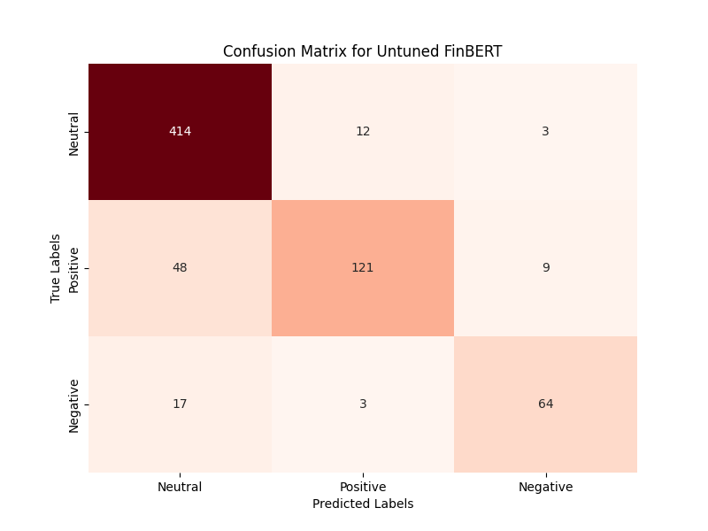
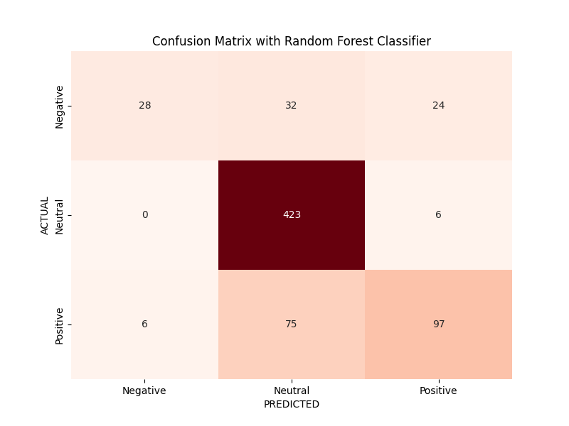
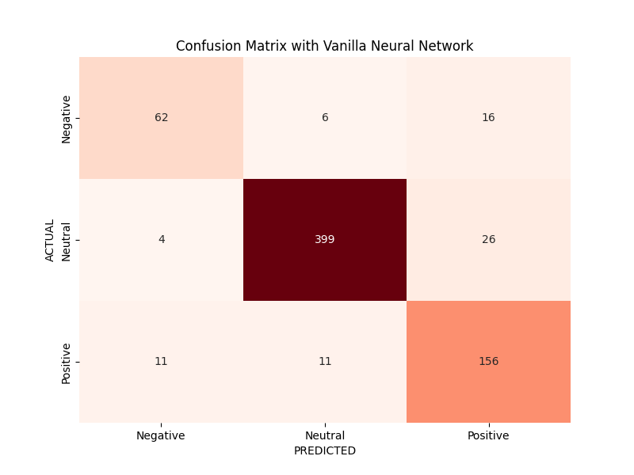

# Analyzing SEC 10-K Corporate Filings: A FinBERT Approach

## Table of Contents
- [Installation ](#installation-)
- [Important Note on Data Collection ](#important-note-on-data-collection-)
- [Results ](#results-)
- [Questions ](#questions-)
- [References ](#references-)
---

```plain
├── data
|   ├── filings.gzip
|   ├── filings.pkl
├── tex
├── ├── assets
|   ├── report.tex
|   ├── ref.bib
├── FinBERT.ipynb
├── environment.yml
├── filings_urls.txt
├── filings_url.py
├── report.pdf
├── README.md
```

## Installation <a id="installation"/>

To clone this repository in your local machine,

```shell
git clone https://github.com/yildirimalper/sec-10k-filings-text-analysis
```

After cloning repository, by using the `environment.yml` file, you can recreate the exact environment required for the project with:

```shell
conda env create -f environment.yml
conda activate sentiment-10k-filings
```

After completing the installation, you will find all the models developed for this project in the `FinBERT.ipynb` notebook. The structure of the `FinBERT.ipynb` can be followed from the **Table of Contents**, at the beginning of the notebook.

The **Scraping and Cleaning SEC Filings** part will not work without a valid SEC EDGAR Filings API key, to obtain an API key, you can find more information in the [Important Note on Data Collection](#note).

In the **Fine-Tuning a Model** part, "yiyanghkust/finbert-pretrain" was fine-tuned step-by-step using the `financial_phrasebank` dataset. 

In the third part, the "yiyanghkust/finbert-pretrain" and fine-tuned FinBERT are implemented over scraped SEC 10-K filings and `financial_phrasebank` respectively. In the last part, the last hidden states of `financial_phrasebank` are obtained and feature extraction models with Random Forest Classifier and a Neural Network are developed and implemented.

Note that the `filings_url.py` file contains a code chunk that retrieves 400 filings URLs, and these URLs, which are scraped for the project, are stored in the `filings_url.txt` file.

### Important Note on Data Collection <a id="note"/>

One of the key components of this project involves scraping and cleaning SEC Filings data from the SEC EDGAR database. To successfully use this feature, you will need to obtain a valid SEC EDGAR Filings API key.

To obtain an API key for accessing SEC EDGAR Filings data, please follow these steps:

1. Visit the [SEC EDGAR Filings API website](https://sec-api.io/).
2. Click the **"Get Free API Key"** button located on the upper right-hand corner of the website.
3. Follow the provided instructions to create an account and obtain your API key.
4. Replace your API key with `API_KEY = "API-KEY"` in *"1. Scraping and Cleaning SEC Filings"* part of Jupyter Notebook.

---

## Results <a id="results"/>

Both untuned and fine-tuned FinBERT models iterated over the SEC 10-K filings yielded fallacious results. Therefore, as an alternative approach, four different approaches implemented over the `financial_phrasebank` dataset: untuned FinBERT, fine-tuned FinBERT, feature extraction via FinBERT with Random Forest Classifier, and, feature extraction via FinBERT with a vanilla Neural Network. Among those four, fine-tuned FinBERT achieved the highest prediction accuracy. Accuracy scores and confusion matrices are displayed below, and the results are discussed in `report_pdf`.

<div align="center">

| Model                                           | Accuracy     |
|-------------------------------------------------|:------------:|
| FinBERT - untuned                               | 0.87         |
| FinBERT - fine-tuned                            | 0.92         |
| Feature Extraction via Random Forest Classifier | 0.79         |
| Feature Extraction via Vanilla Neural Network   | 0.89         |

</div>

<div align="center">

</div>

<div align="center">

</div>

<div align="center">

</div>

<div align="center">

</div>

---

## Questions <a id="questions"/>
***1.** List five different tasks that belong to the field of natural language processing.*

**Answer:** The most relevent tasks for natural language processing are text classification/sentiment analysis, named entity recognition (NER), question answering, summarization, and translation.

***2.** What is the fundamental difference between econometrics/statistics and supervised machine learning?*

**Answer:** In econometrics, we aim to estimate unobservable parameters based on our assumptions, and conduct hypothesis testing about estimated parameters. On the other hand, we use labeled data to train the supervised machine learning model to predict observable things such that we assess the accuracy of the model.

***3.** Can you use stochastic gradient descent to tune the hyperparameters of a random forrest. If not, why?*

**Answer:** No, because stochastic gradient descent is an algorithm that is used to train neural networks such that it computes gradients with respect to the loss function, not an hyperparameter to tune in a random forest model.

***4.** What is imbalanced data and why can it be a problem in machine learning?*

**Answer:** Imbalanced data is the case when the dataset consist mostly of some particular outcome. That may lead fallacious accuracy scores. Assume 99 of 100 e-mails are not spam, and one is spam. If the model classifies all as "not spam", model accuracy is 0.99 but it in fact fails the task.

***5.** Why are samples split into training and test data in machine learning?*

**Answer:** We split dataset into training and test data such that we train our model allowing it learning from the training data, then we use test data to assess model's and accuracy using an unseen data during training. With the train-test split, we can detect overfitting or underfitting such that we can improve the model.

***6.** Describe the pros and cons of word and character level tokenization.*

**Answer:** In the word-level tokenization, the preservation of word structure and the simplicity are the main advantages while the cases of typos, morphology and variations are the limitations to this type of tokenization. On the other hand, character-level tokenization is useful with its small vocabulary sizes, simplicity and the capture of all letters, its main disadvantage is the fact that words lose their structure completely and in terms of computational efficiency, tokenized texts with character-level become very long.

***7.** Why does fine-tuning usually give you a better performing model than feature extraction?*

**Answer:** In fine-tuning, we train all parameters such that the model can specialize on a certain task, i.e., layers before last hidden states are trained such that last hidden states involve relevant information. However, in feature extraction, we train only parameters of classification parameters, that is, base model parameters are frozen and last hidden states might only contain general information, not the nuances of the task.

***8.** What are advantages over feature extraction over fine-tuning?*

**Answer:** First of all, feature extraction is faster compared to fine-tuning as the latter would be very slow without GPUs. In feature extraction, only the parameters of classifcation model is trained rather than all parameters, it is computationally more efficient. Compared to fine-tuning, feature extraction requires less data to train the model, that is, if there exist a few labeled data, feature extraction is more suitable.

***9.** Why are neural networks trained on GPUs or other specialized hardware?*

**Answer:** Since GPUs have remarkable parallel computation capabilities, GPUs can train neural networks models very fast as the matrix calculations, which are at the center of deep learning computations, are completed in parallel.

***10.** How can you write pytorch code that uses a GPU if it is available but also runs on a laptop that does not have a GPU?*

**Answer:** One can add this generic code snippet `device = torch.device("cuda" if torch.cuda.is_available() else "cpu")`. Furthermore, using `.to(device)` is helpful to be sure that both tensors and model are on the same device (GPU or CPU).

***11.** How many trainable parameters would the neural network in this video have if we remove the second hidden layer but leave it otherwise unchanged?*

**Answer:** There will be $784 \times 16 + 16 \times 10$ weights and $16 + 10$ biases, that is, $12740$ parameters in total.

***12.** Why are nonlinearities used in neural networks? Name at least three different nonlinearities.*

**Answer:** Since we want neural network to learn complex, nonlinear relations, we should use nonlinearities through the activation functions. Otherwise, it would simplify into a simple linear model, i.e., $W_2(W_1(W_0x+b_0)+b_1)+b_2=W_x+b$. Potential candidates for nonlinearities are `ReLU` $f(x)=\max(0,x)$, `sigmoid` $\frac{1}{1+e^{-x}}$, and `tanh` (hyperbolic tangent) $f(x)=\frac{e^{x}-e^{-x}}{e^{x}+e^{-x}}$.

***13.** Some would say that `softmax` is a bad name. What would be a better name and why?*

**Answer:** They would say that because `softmax` does not exactly return the maximal element of the input vector. Rather, it returns a probability distribition for the element that maximizes the target function, i.e., it is similar to $\arg\max$ than $\max$. So, we might suggest `softargmax` instead of `softmax`.

***14.** What is the purpose of `DataLoaders` in pytorch?*

**Answer:** `DataLoaders` in PyTorch is a tool that eases the data handling. With its data batching capability, computational resources are efficiently used since large datasets portioned into the smaller ones. Moreover, with its data shuffling capability, the model generalization improved thanks to shuffled data in every training epoch thus increases robustness.

***15.** Name a few different optimizers that are used to train deep neural networks.*

**Answer:** Some optimizers that are used to train deep neural networks are Stochastic Gradient Descent, Adaptive Moment Estimation (Adam), Adaptive Gradient Descent (AdaGrad), and Nesterov Accelarated Gradient (NAG).

***16.** What happens when the batch size during the optimization is set too small?*

**Answer:** If the batch size during the optimization is set too small, then it might be the case that model would not converge to global optimum since the random variation in training data affects the model adversely. This noise in training data may curb the generalization as statistics were not effectively captured, i.e., the suboptimal generalization.

***17.** What happens when the batch size during the optimization is set too large?*

**Answer:** If the batch size during the optimization is set too large, the model tends to be stuck in local optima, leading suboptimal solutions and diminished generalizability. Furthermore, with limited access to GPU memory such as free version of Google Colab, optimization with very large batch sizes might not work, and hinder model's scalability.

***18.** Why can the feed-forward neural network we implemented for image classification not be used for language modelling?*

**Answer:** The image classification requires one-to-one model interface where each image is processed and classified independently to its appropriate label whereas language modelling requires many-to-many model interface as the structure of language is both sequential and contextual. Therefore, a feed-forward neural network designed for image classification is not suitable for language modelling.

***19.** Why is an encoder-decoder architecture used for machine translation (instead of the simpler encoder only architecture we used for language modelling)?*

**Answer:** Fundamentally, in machine translation, we aim to encode an input from the source language, and using that vector representations, to decode it in the target language to generate translated sentence. Since the decoder is the part that takes vector representation as input and create output in the target language, the endoer-decoder architecture instead of encoder-only architecture is used for machine translation.

***20.** Is it a good idea to base your final project on a paper or blogpost from 2015? Why or why not?*

**Answer:** It is not a good idea since the state-of-the-art technology for language modelling tasks were LSTM-RNNs, in other words, Transformer models (introduced in 2017) were not developed yet. Therefore, with a blogpost from 2015, I could not use a specialized language model İn Hugging Face :hugs: in my final project such as FinBERT.

***21.** Do you agree with the following sentence: To get the best model performance, you should train a model from scratch in PyTorch so you can influence every step of the process.*

**Answer:** Not necessarily. Using transfer learning, that is, using a pre-trained model and fine-tuning it for a certain purpose, may lead better model performance with less computational costs compared to training a model from scratch in PyTorch.

***22.** What is an example of an encoder-only model?*

**Answer:** The most well-known example of an encoder-only model is [BERT](https://huggingface.co/bert-base-uncased) (Bidirectional Encoder Representations from Transformers), and BERT is introduced by the researchers at Google in their 2018 article.

***23.** What is the vanishing gradient problem and how does it affect training?*

**Answer:** In a model with an activation function that maps large input space into smaller space such as `sigmoid` or `tanh`, the gradients (derivatives of the loss function) would get exponentially smaller during backpropagation. This, in turn, affects training adversely since the vanishing gradients causes significantly less updates in model's weights and biases, i.e., slower convergence.

***24.** Which model has a longer memory: RNN or Transformer?*

**Answer:** It is clear that Transformer models have longer memory than Recurrent Neural Networks. It is one of the drawbacks of Recurrent Neural Networks on long sequences such that LSTM models developed to improve this thereafter.

***25.** What is the fundamental component of the Transformer architecture?*

**Answer:** Attention mechanism is the fundamental component of the transformer architecture such that the model assigns different words a relative importance (or namely, attention) to each other in a sequence. Attention mechanism significanlty improves the task of obtaining contextual information, therefore, is very prevalent in natural language processing tasks.

---

## References <a id="references"/>

1. Araci, D. (2019). *FinBERT: Financial Sentiment Analysis with Pre-trained Language Models*. arXiv preprint arXiv:1908.10063.

2. DeSola, V., Hanna, K., & Nonis, P. (2019). *FinBERT: Pre-trained Model on SEC Filings for Financial Natural Language Tasks*. University of California.

3. Devlin, J., Chang, M. W., Lee, K., & Toutanova, K. (2018). *BERT: Pre-training of Deep Bidirectional Transformers for Language Understanding*. arXiv preprint arXiv:1810.04805.

4. Fama, E. F. (1970). *Efficient Capital Markets: A Review of Theory and Empirical Work*. The Journal of Finance, 25(2), 383-417.

5. Huang, A. H., Wang, H., & Yang, Y. (2023). *FinBERT: A Large Language Model for Extracting Information From Financial Text*. Contemporary Accounting Research, 40(2), 806-841.

6. Ke, Z. T., Kelly, B. T., & Xiu, D. (2019). *Predicting Returns With Text Data* (No. w26186). National Bureau of Economic Research.

7. King, R. G., & Levine, R. (1993). *Finance and Growth: Schumpeter Might Be Right*. The Quarterly Journal of Economics, 108(3), 717-737.

8. Levine, R. (1997). *Financial Development and Economic Growth: Views and Agenda*. Journal of Economic Literature, 35(2), 688-726.

9. Ravula, S. (2021). *Text analysis in financial disclosures*. arXiv preprint arXiv:2101.04480.

10. Tao, J., Deokar, A. V., & Deshmukh, A. (2018). *Analysing Forward-Looking Statements in Initial Public Offering Prospectuses: A Text Analytics Approach*. Journal of Business Analytics, 1(1), 54-70.

11. Theil, C. K., Štajner, S., & Stuckenschmidt, H. (2018, July). *Word Embeddings-Based Uncertainty Detection in Financial Disclosures*. In Proceedings of the First Workshop on Economics and Natural Language Processing (pp. 32-37).
